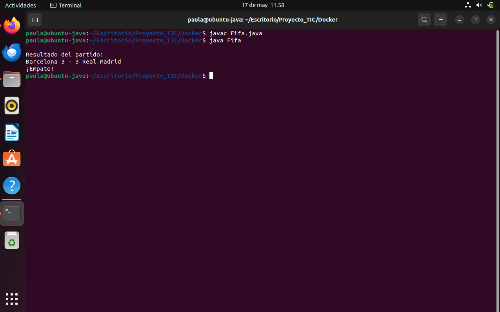

# Resultados y Análisis Comparativo: Máquina Virtual vs Docker

## 1. Introducción

Este documento presenta las mediciones y observaciones realizadas durante la ejecución del juego Java en dos entornos diferentes: una Máquina Virtual Ubuntu y un contenedor Docker.

---

## 2. Medición en Máquina Virtual (Ubuntu)

### Uso de recursos

- **CPU máximo observado:** 10.0% (proceso `gnome-shell`)
- **Memoria usada:** 274 MiB (proceso `java`)  

### Captura de pantalla

  
> Captura del monitor `htop` mostrando el consumo de CPU y memoria RAM mientras se ejecuta el juego Java en Ubuntu. Se observa el proceso `java` (`gnome-shell`) activo con un uso moderado de CPU y memoria.

---

### Resultado del juego

  
> Salida del partido ejecutado en la terminal de la máquina virtual. El juego funcionó correctamente mostrando el resultado:  
> **Barcelona 3 - 3 Real Madrid**  
> **¡Empate!**

---

## 3. Medición en Docker

### Uso de recursos

- **CPU observado:** 0.00%
- **Memoria usada:** 1.371 MiB (0.02%)  

### Captura de pantalla

  
> Monitorización del contenedor Docker mediante `docker stats`. Se observa un consumo de recursos extremadamente bajo tanto en CPU como en memoria.

---

### Resultado del juego (Docker)

  
> Ejecución del contenedor Docker mostrando el resultado del partido:  
> **Barcelona 0 - 2 Real Madrid**  
> **¡Gana Real Madrid!**

---

## 4. Tiempos de arranque

| Entorno             | Tiempo de arranque (segundos) |
|---------------------|-------------------------------|
| Máquina Virtual     | 28                            |
| Contenedor Docker   | 3                             |

---

## 5. Conclusión

Docker resultó ser un entorno más ligero y eficiente para ejecutar el juego Java, consumiendo significativamente menos CPU y memoria que la máquina virtual. Aunque la VM proporciona un entorno completo y flexible para pruebas del sistema operativo, Docker ofrece ventajas claras en rendimiento y eficiencia para ejecutar aplicaciones específicas.  

---

## 6. Referencias

- Repositorio del proyecto: [https://github.com/Paula-Oreja/Proyecto_TIC](https://github.com/Paula-Oreja/Proyecto_TIC)  
- Documentación de Docker: [https://docs.docker.com/](https://docs.docker.com/)  
- Sitio oficial de Ubuntu: [https://ubuntu.com/](https://ubuntu.com/)
